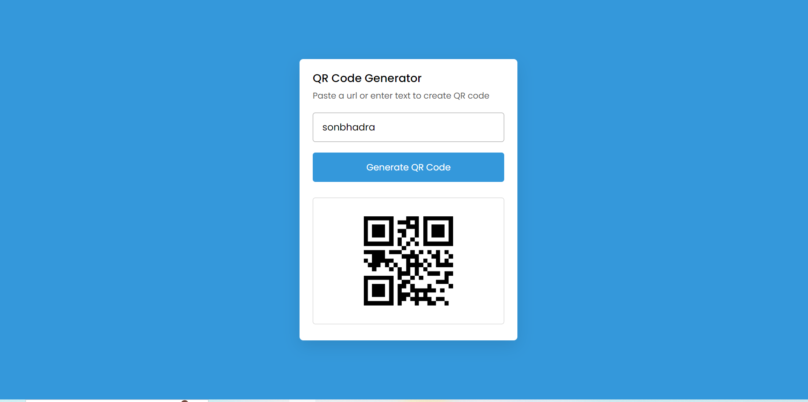

### Build an QR-Code-Generator App that's using to generate a qr code of any text or messages .

# `# QR-Code-Generator`
### This is a simple QR-Code-Generator Web App made using  
- `HTML` 
- `CSS`
- `Javascript`

[Check out the website here](git@github.com:GkY273303/QR-Code-Generator.git)

## `illustrative`

     
    
